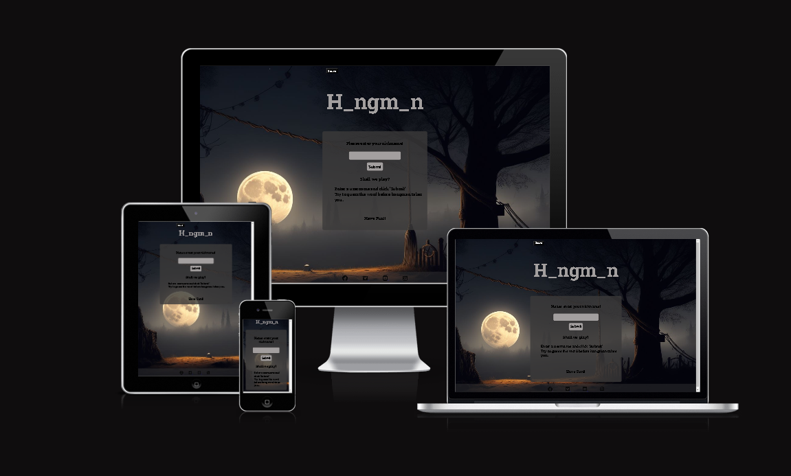

# Hangman game

## Milestone Project 2 

###  I have created this web page as a part of  my Milestone Project 2 for educational purposes only

## Live Project

[My live project](edgarklavins.github.io/Hangman-MP2/)
 

## Repository
[My repository](https://github.com/EdgarKlavins/Hangman-MP2)

## Introduction

The Hangman is a guessing game, that tests the user's knowledge and vocabulary. The player has to complete the word by picking the correct letters. This project was created as a part of milestone project 2 (Bristol College/Code Institute) Level 5 Diploma in Web Application Development. 
Educational purposes only.

### History

Though the origins of the game are unknown, a variant is mentioned in a book of children's games assembled by Alice Gomme in 1894 called Birds, Beasts, and Fishes.[1] This version lacks the image of a hanged man, instead relying on keeping score as to the number of attempts it took each player to fill in the blanks.

A version which incorporated hanging imagery was described in a 1902 article in The Philadelphia Inquirer, which stated that it was popular at "White Cap" parties hosted by Vigilance Committees where guests would wear "white peaked caps with masks"

 Wikipedia

# Technologies Used

## Languages used
<ul>
<li>HTML5</li>
<li>CSS3</li>
<li>JAVA SCRIPT</li>
</ul>

## Frameworks & Tools

- Git
- GitHub
- Gitpod
- Mockplus Classic
- Google Fonts
- Font Awesome
- Photoshop
- Jest

# UX

## Site Goals:

* To showcase the skills I have learned in HTML, CSS and JavaScript.
* To provide users with an interactive game to play that has clear Win / Lose Scenarios.
* To create an enjoyable, interactive game that makes the user want to stay and play again.

#### User stories
* As a user, I want to easily understand the main purpose of the website.
* As a user, I want to view the website and content clearly on any device and resolution
* As a user, I want to have instructions on how to play the game so that I can easily understand the rules.
* As a user, I want to be able to start a game when I am ready.
* As a user, I want to see a hangman image appear each time I guess incorrectly.
* As a user, I want to know whether my guess was successful or not.
* As a user, I want a way to start a new game when the current game has ended.
* As a user, I want to have a moment of surprise, when interacting with the game.
* As a user, I want to see contact information for the site owner in case I want to reach out.

### Testing user stories

As a user, I want to easily understand the main purpose of the website.
* Website contains logo "Hangman" and information about the game.

[Logo and rules](docs/welcome.png)

As a user, I want to view the website and content clearly on any device and resolution.
* The website has been tested on different devices and evidence has been provided (screenshot, top of the page).

As a user, I want to have instructions on how to play the game so that I can easily understand the rules.
* There is a short description for those who have never played the game. (screenshot, check Logo and rules)

As a user, I want to be able to start a game when I am ready.
* The game starts as soon as the player enters the nickname.

[Nickname and Submit](docs/Nickname.png)

As a user, I want to see a hangman image appear each time I guess incorrectly.
* It takes six wrong guesses to complete the hangman image.

[Wrong guess](docs/Firstguess.png)

As a user, I want to know whether my guess was successful or not.
* If the guess was successful it will reveal space in the word, if the guess was wrong, the player will be able to see all wrongly guessed letters, if player has been used already certain letters, a popup will come up and remind it. 

[Popup](docs/popup.png)

As a user, I want a way to start a new game when the current game has ended.
* Each time the player either loses or wins the "play again" button will be available.

[Play again](docs/Playagain.png)

As a user, I want to have a moment of surprise, when interacting with the game.
* Each time the player presses "a" key, it will make H_NGM_N logo to change and fill in unknown letters.

[Header](docs/header.png)

 

[Header after pressing "A"](docs/header2.png)

As a user, I want to see contact information for the site owner in case I want to reach out.
* Social network icons are all available at any time, located in the footer.

[Footer](docs/footer.png)

### Structure

#### Wireframes

The structure of the initial site will include three sections incorporated in the index.html page:

1. **Welcome Section** displays the rules of the game and asks the user to input a username in order to proceed to play the game.

<a href="docs/Wireframe_desktop1.png">Welcome page</a>

<a href="docs/Wireframe_phone.png">Welcome page phones</a>

2. **Gaming area** containing the keyboard, and figurine, displayed all guessed wrong letters

<a href="docs/Wireframe_desktop2.png">Game area</a>

<a href="docs/Wireframe_phone2.png">Game area phone</a>

3. **Endgame popup** which congratulates the player and gives the option to play again

<a href="docs/Wireframe_desktop3.png">End game</a>

<a href="docs/Wireframe_phone3.png">End game phone</a>

### Features

#### Welcome Section

 

- Features an input field. The user is required to enter a username to continue. A submit button initiates the next section if a username has been entered. The rules of the game are also diplayed.

#### Game Section

 

- Features the nickname displayed at the top of the central content area.
- Clickable on-screen keyboard element. 
- A Hangman image
- Feedback to the user about guessed letters and wrong letters
- Option to turn sound on or off.

#### End of Game page

 
- Player is notified if he lost or won the game
- Player can choose to play again immediately

#### Header

- The header remains on display at the top of the game throughout a user's journey through the game.
- It tells the user clearly what the content and purpose of the application is.
- It contains sound on/off button
- It is interactive and changes when certain requirements are met.

#### Footer

- Includes links to the LinkedIn, Facebook, Instagram and Twitter pages of the developer.
- All links open in a new window.

### Colour Scheme

I have chosen to use rgba(61, 61, 59, 0.4) light grey color for footer and containers with a little bit of opacity, because it blends in nicely in background picture.

### Typography

The Roboto Slab font is the main font used throughout the whole website with Sans Serif as the fallback font in case for any reason the font isn't being imported into the site correctly.

## Testing and Validation

### Peer review 

After making my project aviable to others, a few things were pointed out:

* Letter background was too dark
* Wrong letter container was coliding with figurine on smaller resolutions
* " You have already used this letter" text popup, had a bad placement and to bright color

All recomendations  were tested and taken care of

### Jest Manual testing

I have manualy tested 4 main functions, which are crucial for game to run:

* When the game starts it should chose one random word from the array for player to guess. Pass
* Should dispatch a KeyboardEvent with the specified key, because I have added virtual keyboard for mobile platforms. Pass
* Should update wrongLettersE1 and figureParts correctly, ass player guesses right or wrong. Pass
* Should remove the notification after a delay. Pass

 

### HTML Validation

The W3C Markup Validation Service was used to validate the HTML of the website. All pages passed with no errors or warnings. 

### CSS Validation

The W3C Jigsaw CSS Validation Service was used to validate the CSS of the website. The code passed with no errors or warnings.

### JavaScript Validation

The linter <a href="https://jshint.com/">JSHint</a> was used to validate the JavaScript files. Unused variable warnings were ignored, as those variables or functions where called/used in either the HTML files or other JS files. All remaining warnings stem from the JShint configuration and are not related to the code.

* First part

 
 

* second part
 
 

 
 

* third part
 
 

 
 

* fourth part
 
 

 

### Accessibility & Performance

The Lighthouse feature on Google Devtools was used to assess accessibility and performance. All pages score high

 

### Browser Compatability

The website compatibility was tested on the following browsers:

* Google Chrome
* Mozilla Firefox
* Microsoft Edge
* Safari

## Bugs & Fixes

* When the website is accessed from GitHub pages sound is not working properly. /Fixed, by changing the rout.
* On mobile platforms keyboard did not activate keydown event. / Fixed by adding small keyboard on the screen.
* While using capital letters, Hangman game did not register keydown event. /Fixed by adding function, which ignores case sensitive.
* Currently no known bugs remaining.

## Deployment & Development

The website was deployed using GitHub Pages by following these steps:

1. In the GitHub repository navigate to the Settings tab.
2. Select Pages from the menu on the left-hand side of the page.
3. For the source select Branch: 'main' and then select: 'save'.
4. After the webpage refreshes automatically a ribbon at the top will display the following message: "Your site is live at https://edgarklavins.github.io/Hangman-MP2/
The website repository can be forked by the following steps:

1. Go to the GitHub repository.
2. Click on the Fork button in the upper right hand corner.

The repository can be cloned by the following steps:

1. Go to the GitHub repository.
2. Locate the Code button above the list of files and click on it.
3. Select if you prefer to clone using HTTPS, SSH, or Github CLI and click the copy button to copy the URL to your clipboard.
4. Open Git Bash.
5. Change the current working directory to the one where you want the cloned directory.
6. Type git clone and paste the URL from the clipboard ($ git clone https://github.com/EdgarKlavins/Hangman-MP2)
7. Press Enter to create your local clone.

## Credits

### Media

The main background picture was taken from https://unsplash.com
Sounds used from https://www.epidemicsound.com/

### Code

Resources came from a few sources:

* https://www.freecodecamp.org
* https://app.slack.com/
* https://www.youtube.com
* https://jestjs.io

## Acknowledgements

Thanks to Code institute and Bristol College for their support.